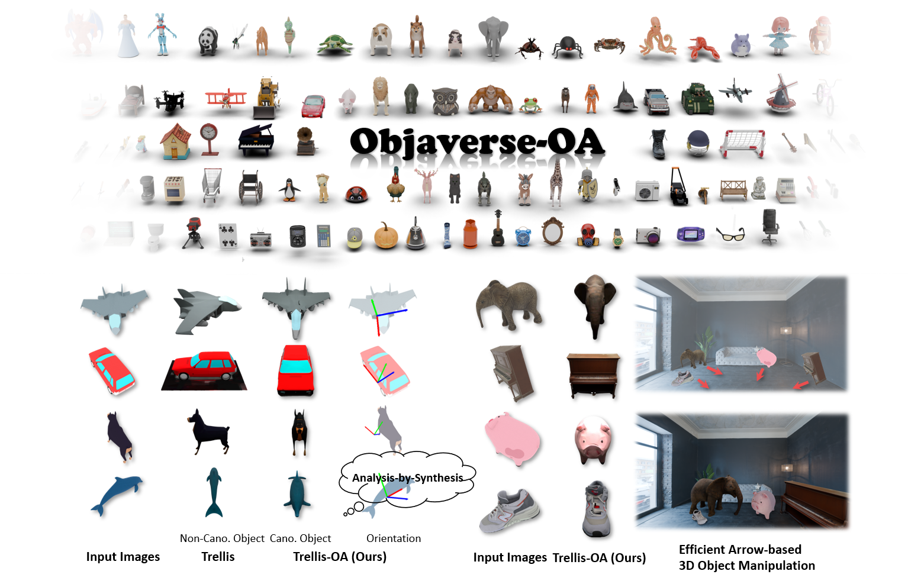

# Orientation Matters (NeurIPS 2025)
Official repository for the paper "Orientation Matters: Making 3D Generative Models Orientation-Aligned"

<div align="center">
 
 &nbsp;
 <a href='https://xdimlab.github.io/Orientation_Matters/'></a> &nbsp;
 <a href='https://arxiv.org/abs/2506.08640'></a> &nbsp;
 <a href='https://huggingface.co/Louischong/Trellis-OA'></a> &nbsp;
  <a href='https://huggingface.co/datasets/Louischong/Objaverse-OA'></a> &nbsp;
</img>
</div>

Humans intuitively perceive object shape and orientation from a single image, guided by strong priors about canonical poses. However, existing 3D generative models often produce misaligned results due to inconsistent training data, limiting their usability in downstream tasks. To address this gap, we introduce the task of orientation-aligned 3D object generation: producing 3D objects from single images with consistent orientations across categories. To facilitate this, we construct Objaverse-OA, a dataset of 14,832 orientation-aligned 3D models spanning 1,008 categories. Leveraging Objaverse-OA, we fine-tune two representative 3D generative models based on multi-view diffusion and 3D variational autoencoder frameworks to produce aligned objects that generalize well to unseen objects across various categories. Experimental results demonstrate the superiority of our method over post-hoc alignment approaches. Furthermore, we showcase downstream applications enabled by our aligned object generation, including zero-shot model-free object orientation estimation via analysis-by-synthesis and efficient arrow-based object rotation manipulation in 3D simulation systems.

## 🔥 News
- 2025.11.25 We release the [Objaverse-OA](https://huggingface.co/datasets/Louischong/Objaverse-OA) dataset.
- 2025.7.20 We release the pre-trained models and codes of Trellis-OA, Wonder3D-OA, and orientation estimation method.
- 2025.6.25 We release the [Huggingface Demo](https://huggingface.co/spaces/Louischong/Trellis-OA)🤗 and pre-trained [model](https://huggingface.co/Louischong/Trellis-OA)🤗 of Trellis-OA. Have a try!

### 📝 TODO List
- [x] Add Huggingface demo, inference code and pre-trained checkpoint of Trellis-OA.
- [x] Add checkpoint and inference code of Wonder3D-OA.
- [x] Add checkpoint and inference code of the orientation estimation method.
- [x] Release the Objaverse-OA dataset.
- [ ] Add code of the augmented reality application.
- [ ] Add the Blender add-on of our arrow-based manipulation.

## Install

Tested on NVIDIA A6000 and 3090 GPU.

```
# create conda environment
conda create -n orient_mat python=3.10
conda activate orient_mat

# install cuda
conda install cuda -c nvidia/label/cuda-11.8.0

# install pytorch
pip install torch==2.4.0 torchvision==0.19.0 torchaudio==2.4.0 --index-url https://download.pytorch.org/whl/cu118

# install xformers
pip install xformers==0.0.27.post2 --index-url https://download.pytorch.org/whl/cu118

# install nvdiffrast
pip install git+https://github.com/NVlabs/nvdiffrast.git
```

### Install dependencies for 3D generation


```
# install dependencies for trellis_oa
. trellis_oa/setup.sh --basic --flash-attn --diffoctreerast --spconv

# install kaolin
pip install Cython==0.29.37
git clone https://github.com/NVIDIAGameWorks/kaolin.git
pip install -e kaolin/.

# install dependencies
pip install -r requirements_3d.txt

# a modified gaussian splatting (+ depth, alpha rendering)
git clone --recursive https://github.com/ashawkey/diff-gaussian-rasterization
pip install ./diff-gaussian-rasterization
```


### Install dependencies for orientation estimation

```
# install Eigen3 3.4.0 under conda environment
conda install conda-forge::eigen=3.4.0

# install dependencies
pip install -r requirements_pose.txt

# install unidepth
pip install -e orientation_estimation/data_preprocessing/.

# install pytorch3d
git clone https://github.com/facebookresearch/pytorch3d
pip install -e pytorch3d/.

# build extensions
conda install boost
CMAKE_PREFIX_PATH=$CONDA_PREFIX/lib/python3.10/site-packages/pybind11/share/cmake/pybind11 bash orientation_estimation/pose_refinement/build_all_conda.sh
```

## Pretrained Weights

Our pretrained weights can be downloaded from Huggingface:

| Module Name | Pretrained Weights |
| --------- | --------- |
| Trellis-OA | [download](https://huggingface.co/Louischong/Trellis-OA) |
| Wonder3D-OA | [download](https://huggingface.co/Louischong/Wonder3D-OA) |
| Orientation Estimation | [download](https://huggingface.co/Louischong/Orientation_Estimation) |

You can also download the pretrained weights using [huggingface cli](https://huggingface.co/docs/huggingface_hub/guides/cli).

Example for Trellis-OA and Orientation Estimation:

```
mkdir -p ./checkpoints/trellis_oa
huggingface-cli download --resume-download Louischong/Trellis-OA --local-dir ./checkpoints/trellis_oa
mkdir -p ./checkpoints/orientation_estimation
huggingface-cli download --resume-download Louischong/Orientation_Estimation --local-dir ./checkpoints/orientation_estimation
```

## Inference

### Trellis-OA

Run Trellis-OA using the shell script:

```
sh run_trellis_oa.sh $IMG_PATH $SAVE_DIR $CHECKPOINT_DIR
```

where `$IMG_PATH` is the path to the image, `$SAVE_DIR` is the directory to save the results, and `$CHECKPOINT_DIR` is the directory containing the pretrained weights. The 3D model will be saved in `$SAVE_DIR/trellis_oa_results`.

For example, download the pretrained weights to `./checkpoints/trellis_oa` and run the following command:

```
sh run_trellis_oa.sh ./assets/boat.png ./results/boat ./checkpoints/trellis_oa
```

### Wonder3D-OA

Run Wonder3D-OA using the shell script:

```
sh run_wonder3d_oa.sh $IMG_DIR $IMG_NAME $SAVE_DIR $CHECKPOINT_DIR
```

where `$IMG_DIR` is the directory containing the image, `$IMG_NAME` is the name of the image, `$SAVE_DIR` is the directory to save the results, and `$CHECKPOINT_DIR` is the directory containing the pretrained weights. The 3D model will be saved in `$SAVE_DIR/wonder3d_oa_results`.

For example, download the pretrained weights to `./checkpoints/wonder3d_oa` and run the following command:

```
sh run_wonder3d_oa.sh ./assets boat.png ./results/boat ./checkpoints/wonder3d_oa
```

### Orientation Estimation

Run Orientation Estimation using the shell script:

```
sh run_orientation_estimation.sh $IMG_PATH $SAVE_DIR $3D_MODEL_PATH $CHECKPOINT_DIR
```

where `$IMG_PATH` is the path to the image, `$SAVE_DIR` is the directory to save the results, `$3D_MODEL_PATH` is the path to the generated 3D model (.glb file is recommended), and `$CHECKPOINT_DIR` is the directory containing the pretrained weights. The orientation estimation results will be saved in `$SAVE_DIR/orientation_estimation_results`.

For example, download the pretrained weights to `./checkpoints/orientation_estimation` and run the following command:

```
sh run_orientation_estimation.sh assets/boat.png ./results/boat ./results/boat/trellis_oa_results/sample.glb ./checkpoints/orientation_estimation
```


## Dataset

You can download the Objaverse-OA dataset from Huggingface:
```
huggingface-cli download --repo-type dataset --resume-download Louischong/Objaverse-OA --local-dir ./datasets/objaverse_oa
```

## Acknowledgement

Our code is built upon the following open-source projects:
[Wonder3D](https://github.com/xxlong0/Wonder3D), [LGM](https://github.com/3DTopia/LGM), [Trellis](https://github.com/microsoft/TRELLIS), [FoundationPose](https://github.com/NVlabs/FoundationPose), [UniDepth](https://github.com/lpiccinelli-eth/UniDepth), [DINOV2](https://github.com/facebookresearch/dinov2). Thanks for their great work!

## 🔗 Citation
If you find this work helpful, please consider citing:
```BibTeXw
@misc{lu2025orientationmatters,
      title={Orientation Matters: Making 3D Generative Models Orientation-Aligned}, 
      author={Yichong Lu and Yuzhuo Tian and Zijin Jiang and Yikun Zhao and Yuanbo Yang and Hao Ouyang and Haoji Hu and Huimin Yu and Yujun Shen and Yiyi Liao},
      year={2025},
      eprint={2506.08640},
      archivePrefix={arXiv},
      primaryClass={cs.CV},
      url={https://arxiv.org/abs/2506.08640}, 
}
```

